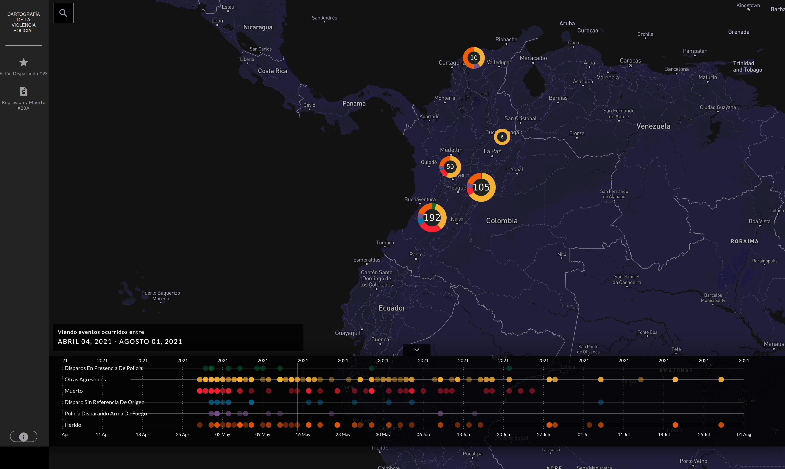

# Violencia Policial


<p align="center">
  <strong>TimeMap es una herramienta para explorar, monitorear y clasificar eventos en el tiempo y el espacio.<br>Aquí <a href="https://cerosetenta.uniandes.edu.co/represion-y-muerte-en-las-calles-de-colombia/">un ejemplo</a>.</strong><br>
</p>



## Información general

TimeMap es una aplicación de frontend que permite explorar eventos en el tiempo y en el espacio. Esta versión se basa en un software *open source* desarrollado por [Forensic Architecture](https://github.com/forensic-architecture/timemap) y usa [mapbox](https://www.mapbox.com/) como mapa base.

Para el desarrollo backend de este mapa se recomienda utilizar [Datasheet Server](https://github.com/enflujo/datasheet-server), otra aplicación también desarrollada por [Forensic Architecture](https://github.com/forensic-architecture/datasheet-server), que hace posible organizar y modificar los datos que alimentan el mapa, usando una hoja de cálculo de Google como una tabla dinámica. El backend y el frontend, actualmente, se alojan en distintos servidores.

TimeMap permite:

- Visualizar eventos en un mapa.
- Visualizar y filtrar estos eventos en el tiempo, por medio de una línea de tiempo.
- Organizar y visualizar los eventos por categoría.
- Mostrar información, imágenes y videos asociados a cada evento.

Este es un ejemplo del uso de TimeMap, resultado de una investigación realizada por [Cerosetenta](https://cerosetenta.uniandes.edu.co/?category_name=0) sobre la violencia policial en las movilizaciones sociales de 2021 en Colombia: [Cartografía de la violencia policial](https://cerosetenta.uniandes.edu.co/represion-y-muerte-en-las-calles-de-colombia/).

## Usar este repositorio

Forensic Architecture tiene un [tutorial completo](https://forensic-architecture.org/investigation/timemap-for-cartographic-platforms) sobre el uso y las posibilidades de la versión original de este repositorio. Algunas cosas varían en este proyecto particular, parcialmente modificado por EnFlujo.

### Instrucciones

Para usar este repositorio por primera vez de forma local:

1. Clonar el repositorio

```shell
git clone https://github.com/enflujo/timemap.git
```

2. En la carpeta del repositorio instalar las dependencias utilizando yarn. 

(Para esto Node y Yarn deben estar instalados en el computador. Puede usar nvm para instalar distintas versiones de Node localmente y luego usar `npm install --global yarn` para instalar Yarn de forma global. 

```shell
yarn
```

3. Correr el servidor de desarrollo, al cual se podrá acceder en http://localhost:8080

```shell
yarn dev
```

Aclaración importante: TimeMap puede correrse sin datos pero no mostrará eventos. Para que muestre información en el mapa y en la línea de tiempo es necesario que reciba datos, en este caso de [Datasheet Server](https://github.com/enflujo/datasheet-server).

#### Correr el proyecto sin datasheet-server

Técnicamente, TimeMap es agnóstico al backend, sin embargo requiere una serie de endpoints que provean datos para visualizar. Los datos se esperan en formato JSON. Algunos de los elementos de los datos son obligatorios y su formato tiene, a su vez, campos obligatorios. Otros endpoints adicionales son opcionales y, si están habilitados, simplemente agregarán otras funciones.

La combinación de todos los tipos de datos, en el contexto de TimeMap, es llamado el `dominio` de la aplicación.

## Publicar el mapa

Antes de subir el mapa al servidor es necesario preparar la aplicación con

```shell
yarn build
```

Esto creará en la raíz del proyecto una carpeta 'build' que contendrá una carpeta 'js' y otros archivos, entre ellos el index.html y el index.css.

Para publicar el mapa por primera vez debe subirse la carpeta 'build' al servidor que va a alojar la aplicación. Si el mapa muestra imágenes o videos, estos también deben subirse al servidor creando una carpeta 'imgs' y una 'videos'.

## Actualizar el mapa

Para actualizar el mapa manualmente después de haber hecho cambios en el frontend es necesario borrar los archivos de la carpeta local 'build' (exceptuando las imágenes y los videos) y correr localmente el comando:

```shell
yarn build
```

Luego, reemplazar los archivos subidos al servidor por los nuevos archivos generados por el *build*.

Para mostrar nuevas imágenes o videos solo hay que agregarlos a las respectivas carpetas en el servidor. No es necesario hacer el build si lo único que se quiere es mostrar estas nuevas imágenes o videos.

También es posible actualizar el mapa automáticamente al hacer un push utilizando Github Actions.

## Contribuir

### [Código de Conducta (ENG)](CODE_OF_CONDUCT.md)

Queremos y trabajamos por una comunidad inclusiva y respetuosa alrededor de la programación creativa. Antes de contribuir al repositorio original por favor leer el código de conducta de Forensic Architecture.

### [Guía de contribución al repositorio original (ENG)](CONTRIBUTING.md)

Guía sobre el proceso de desarrollo de Forensic Architecture.

## [Licencia](LICENSE.md)

TimeMap es distribuida bajo [licencia DoNoHarm](https://github.com/raisely/NoHarm).